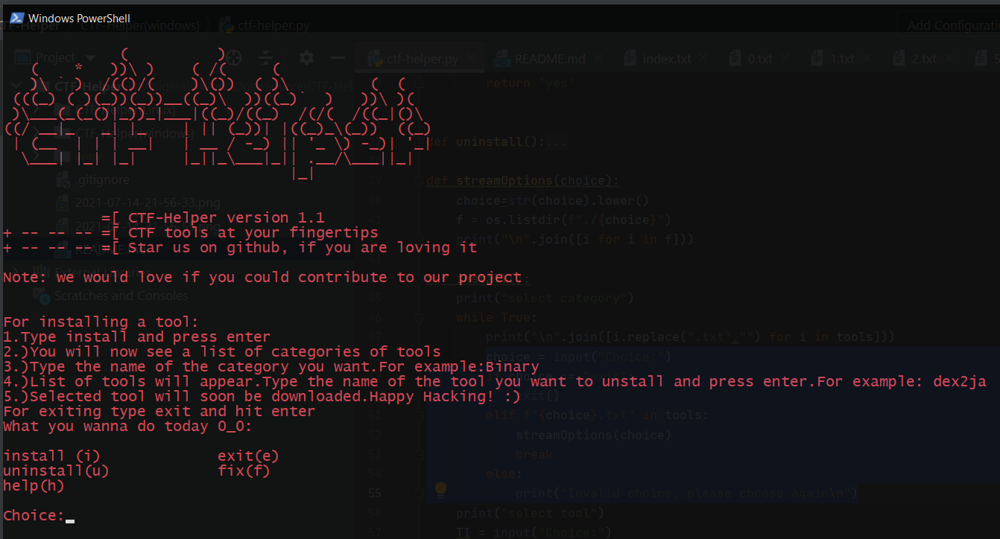
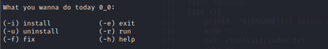

# **CTF-Helper**

## Basic Overview

An open source CTF-DB , which stores various Techniques of solving a particular genre of CTF. Similar to sec-tools, but its cross platform for linux as well as windows.



## Installation

### Windows
Clone the repository
Under CTF-Helper(windows) run ctf-helper.py
```
python ctf-helper.py
```
### Linux
Clone the repository 
Under CTF-Helper(linux) run ctf-helper.sh
```
# Giving permission to execute
chmod +x ctf-helper.sh 
# running the bash file
./ctf-helper.sh
```

## Usage

```
# advised to install these packages before use
pip install wget
```
```
# install to install the tool first you have to select the category and then the tool
# list to list the available tools that you can install
# help help command
# fix to repair the files 
# exit to exit the program
```
## Licence
The individual tools are all licensed under their own licenses. As for ctf-helper itself, it is "starware". If you find it useful, star it on github

## Acknowledgements
Built upon [sec-tools](https://github.com/eugenekolo/sec-tools). Be sure to check them out.
